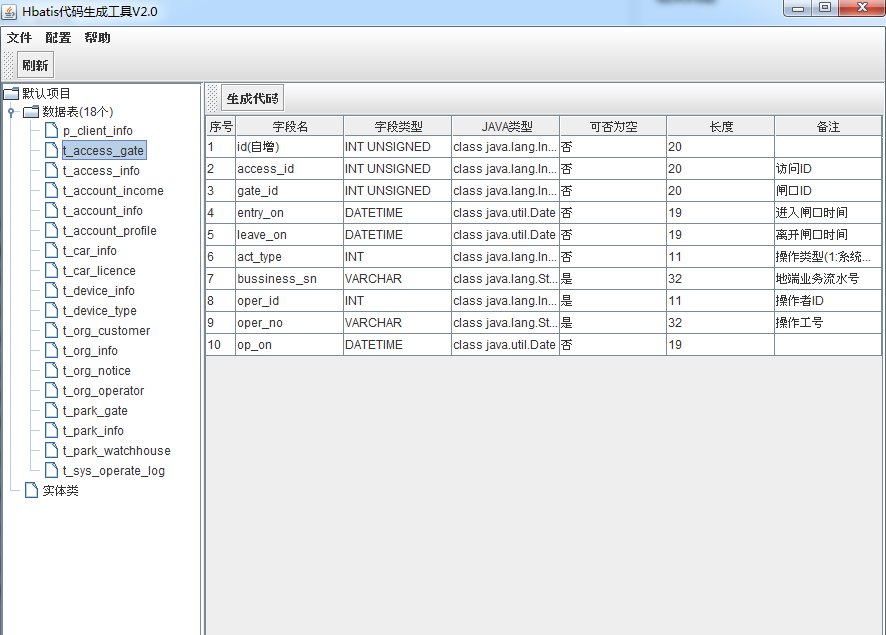
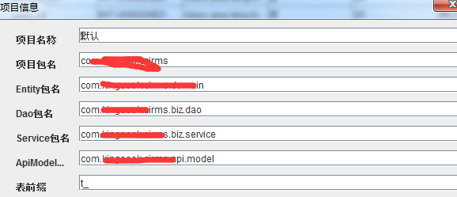

# hbatis
> 基于mybatis的crud解决方案


## hbatis是什么

> 建立在mybatis之上的 单表通用操作（新增、修改、删除、按字段查、按字段更新等）。减小重复性的、逻辑简单的xml配置，在不侵入mybatis的成本下，以几乎等同的代码量，
完成单表的CRUD操作，可通过代码构建Statement。大大提高代码的可维护性。

## hbatis的由来
>- mybatis generator 生成的代码及xml十分臃肿 及难以维护。
>- mybatis generator 生成的代码功能较弱 且 xml几乎不可复用
***
# 开始之旅
## POM.xml
```xml
<dependency>
	<groupId>org.mybatis.hbatis</groupId>
	<artifactId>hbatis-spring</artifactId>
	<version>2.0</version>
</dependency> 
```    
## 配置文件
 ### 不使用hbatis
 ```xml
 <bean id="sessionManager" class="org.mybatis.spring.support.SqlSessionDaoSupport" lazy-
      init="false" scope="singleton">
		  <property name="sqlSessionFactory" ref="sqlSessionFactory"></property>
 </bean>
```
 ### 使用hbatis
 ```xml
  <bean id="sessionManager" 
         class="org.mybatis.hbatis.spring.HbatisSqlSessionDaoSupport" lazy-
         init="false" scope="singleton">
	<property name="sqlSessionFactory" ref="sqlSessionFactory"></property>
  </bean>
```
 > 如此即开启了hbatis支持，是不是 So easy ?!
 
 ## Entity
 ```Java
 @Table(OrgInfo.EntityNode.class)
public class OrgInfo implements Serializable {
	
	private static final long serialVersionUID = 1L;
	/**
	  * ID
	  * nullable:true,length:11
	  */
	@Column(primaryKey = true,autoIncrement = true,comment = "ID")	
	private Integer id;
	/**
	  * 
	  * nullable:false,length:32
	  */
	@Column(comment = "")	
	@NotNull
	private String code;
	/**
	  * 
	  * nullable:false,length:128
	  */
	@Column(comment = "")	
	@NotNull
	private String secret;
	/**
	  * 名称
	  * nullable:false,length:64
	  */
	@Column(comment = "名称")	
	@NotNull
	private String name;
	/**
	  * 图片
	  * nullable:true,length:256
	  */
	@Column(comment = "图片")	
	private String imgSrc;
	/**
	  * 类型(1:个人,2:机构,3:机关单位,4:企业)
	  * nullable:false,length:11
	  */
	@Column(comment = "类型(1:个人,2:机构,3:机关单位,4:企业)")	
	@NotNull
	private Integer type;
	/**
	  * 官网
	  * nullable:true,length:250
	  */
	@Column(comment = "官网")	
	private String website;
	/**
	  * 地址
	  * nullable:true,length:250
	  */
	@Column(comment = "地址")	
	private String address;
	/**
	  * 电话
	  * nullable:true,length:32
	  */
	@Column(comment = "电话")	
	private String tel;
	/**
	  * 邮箱
	  * nullable:true,length:64
	  */
	@Column(comment = "邮箱")	
	private String email;
	/**
	  * 联系人
	  * nullable:true,length:32
	  */
	@Column(comment = "联系人")	
	private String contactor;
	/**
	  * 状态
	  * nullable:false,length:4
	  */
	@Column(comment = "状态")	
	@NotNull
	private Byte status;
	/**
	  * 备注
	  * nullable:true,length:500
	  */
	@Column(comment = "备注")	
	private String remark;
	/**
	  * 
	  * nullable:false,length:19
	  */
	@Column(comment = "")	
	@NotNull
	private Date opOn;
	/**
	  * 
	  * nullable:false,length:11
	  */
	@Column(comment = "")	
	@NotNull
	private Integer opBy;
        
	... get and set 

    public static class EntityNode extends AbstractEntityNode<OrgInfo> {
        public static final EntityNode INSTANCE = new EntityNode("toi");;
    	/** ID */
        public FieldNode<OrgInfo, Integer> id =  createFieldNode("id","id",Integer.class,JdbcType.INTEGER);
    	/**  */
        public FieldNode<OrgInfo, String> code =  createFieldNode("code","code",String.class,JdbcType.VARCHAR);
    	/**  */
        public FieldNode<OrgInfo, String> secret =  createFieldNode("secret","secret",String.class,JdbcType.VARCHAR);
    	/** 名称 */
        public FieldNode<OrgInfo, String> name =  createFieldNode("name","name",String.class,JdbcType.VARCHAR);
    	/** 图片 */
        public FieldNode<OrgInfo, String> imgSrc =  createFieldNode("imgSrc","img_src",String.class,JdbcType.VARCHAR);
    	/** 类型(1:个人,2:机构,3:机关单位,4:企业) */
        public FieldNode<OrgInfo, Integer> type =  createFieldNode("type","type",Integer.class,JdbcType.INTEGER);
    	/** 官网 */
        public FieldNode<OrgInfo, String> website =  createFieldNode("website","website",String.class,JdbcType.VARCHAR);
    	/** 地址 */
        public FieldNode<OrgInfo, String> address =  createFieldNode("address","address",String.class,JdbcType.VARCHAR);
    	/** 电话 */
        public FieldNode<OrgInfo, String> tel =  createFieldNode("tel","tel",String.class,JdbcType.VARCHAR);
    	/** 邮箱 */
        public FieldNode<OrgInfo, String> email =  createFieldNode("email","email",String.class,JdbcType.VARCHAR);
    	/** 联系人 */
        public FieldNode<OrgInfo, String> contactor =  createFieldNode("contactor","contactor",String.class,JdbcType.VARCHAR);
    	/** 状态 */
        public FieldNode<OrgInfo, Byte> status =  createFieldNode("status","status",Byte.class,JdbcType.TINYINT);
    	/** 备注 */
        public FieldNode<OrgInfo, String> remark =  createFieldNode("remark","remark",String.class,JdbcType.VARCHAR);
    	/**  */
        public FieldNode<OrgInfo, Date> opOn =  createFieldNode("opOn","op_on",Date.class,JdbcType.TIMESTAMP);
    	/**  */
        public FieldNode<OrgInfo, Integer> opBy =  createFieldNode("opBy","op_by",Integer.class,JdbcType.INTEGER);
	
        /**
         * @param alias 别名
         */
        public EntityNode(String alias) {
            super(OrgInfo.class,"t_org_info",alias);
        }
    }
    
    // ==== 自定义属性 ====
}
```
 
 ## DAO
 > 继承HbatisMapper
 ```Java
 /**
 * OrgInfoMapper
 * @author generator
 * @date 2017年07月11日
 */
public interface OrgInfoMapper extends HbatisMapper<OrgInfo, Integer> {
	
	
	//-- 按实体参数查询[START] 
	List<OrgInfo> findByQueryParam(@Param("queryParam")OrgInfo.QueryParam queryParam);
	
	long countByQueryParam(@Param("queryParam")OrgInfo.QueryParam queryParam);
	//-- 按实体参数查询[END] 
	
	//-- 自定义业务方法，请写在下方 -->
}
```
## Service 
> 在Service 中调用Mapper接口

```Java
/**
 * 删除
 * 
 * @param id
 */
public void deleteById(Integer pk) {
	repo.deleteByPK(pk);
}

/**
 * 通过id获取
 * 
 * @param id
 * @return
 */
public OrgInfo findById(Integer pk) {
	return repo.selectByPK(pk);
}

/**
 * 通过非空属性查询
 * 
 * @param OrgInfo
 * @return
 */
public List<OrgInfo> findByNotNullProps(OrgInfo entity) {

	SelectStatement<OrgInfo> st = StatementBuilder.buildSelectSelective(entity);
	return repo.selectByStatement(st);
}
/**
 * 单表通用查询样例
 * 
 * @param OrgInfo
 * @return
 */
@Override
public OrgInfo findByCode(String code) {
	OrgInfo.EntityNode n = OrgInfo.EntityNode.INSTANCE;
	SelectStatement<OrgInfo> st = StatementBuilder.buildSelect(n);
	st.restrictions().add(n.code.eq(code));
	return CollectionUtil.uniqueResult(this.repo.selectByStatement(st));
}
  
  ```

# 代码生成器
> 角色类似 mybatis-generator




